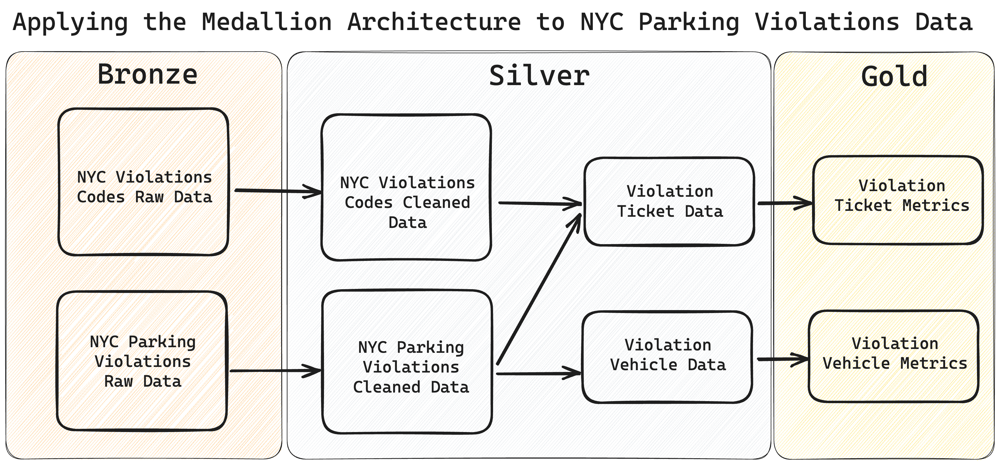
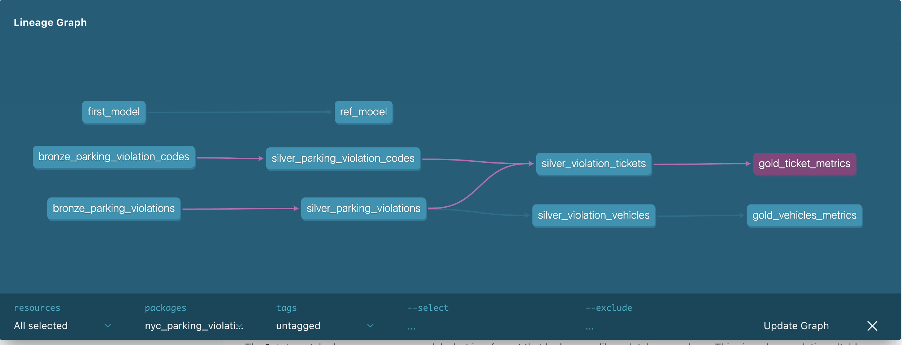
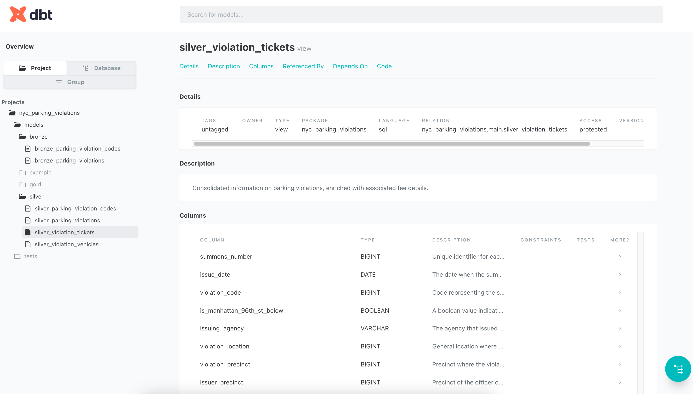

# Data-Engineering-with-dbt
Data Engineering with dbt

# Setup Python Virtual Environment

    python -m venv myenv
    source myenv/bin/activate
    pip install -r requirements.txt

# Ensure Required Tools are installed

    pip install --upgrade pip setuptools

# Install System Dependencies

    brew install cmake ninja pkg-config

# Verify

    pip show dbt-core
    pip show dbt-duckdb

# DBT

    dbt init
    nyc_parking_violations
    [1] duckdb

# Configure DBT Profiles
 https://github.com/duckdb/dbt-duckdb#configuring-your-profile
 Copy config to profiles.yml as template if not exists 

    cd nyc_parking_violations 
    touch profiles.yml

    dbt debug (will fail)

    copy dbt_projects.yml models name `nyc_parking_violations` to profiles.yml as default

    cd /nyc_parking_violations/models
    touch first_model.sql

# DBT Commands
 
    dbt debug (need to be in dbt project directory)
    dbt compile (runs all db models end to end but does not execute)
    dbt run (runs all db models end to end, executes sql code, and materializes tables based on profile configurations)
    dbt docs generate (view dbt project data lineage)
    dbt docs serve (create local instance of website based on meta data)
    dbt test (run tests)
    dbt compile --target prod (compile prod database)
    dbt run --target prod (run prod database)

# GitHub Actions